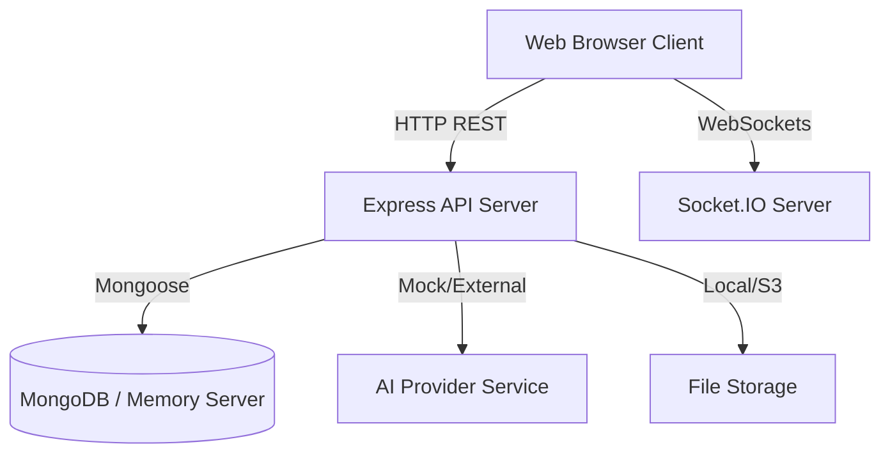

# System Architecture

This document describes the design, components, flow, and interfaces of the AI Interview Website platform.

## System Topology Diagram

---

## Component Layers

### 1. Database Connection and Memory Fallback
To ensure maximum portability and ease of installation:
*   The connection checks for a local MongoDB process at port `27017`.
*   If none is detected, it spins up an instance of `mongodb-memory-server` in the background and redirects all Mongoose models to connect to it.
*   Upon startup, the database is auto-seeded with default `Admin` accounts, `JobRoles`, `InterviewTemplates`, and outreach `Campaigns`.

### 2. Admin Portal Services
*   **Authentication**: Session handled via signed JSON Web Tokens (JWT) stored in LocalStorage, validated through the `protectAdmin` middleware.
*   **Live Proctoring & Monitoring**: Uses Socket.IO rooms. When a candidate joins the interview room, socket communication connects them to the active room. Whenever a tab-switch or blur is captured, an event is sent to the `admin_monitoring` namespace, which streams the event to the active Live Monitor console.
*   **Result Verification**: System generates multi-criteria grading reports using the prompt orchestrator. Results are locked until the Admin explicitly triggers the `release` function.

### 3. Candidate Experience
*   **Checklist State Machine**: Tracks candidate readiness inside `sessionStorage` ensuring they upload their resume, verify identity via camera webcam, pass the audio level checks, and agree to fullscreen/integrity guidelines.
*   **Interview Proctoring Room**:
    *   Locks page into fullscreen mode via HTML5 requestFullscreen.
    *   Tracks blur/focus losses and tab switches, reporting back to the backend.
    *   Provides an interactive voice interface allowing candidates to record their answers, preview them, and submit them.
    *   Mock Speech-to-Text and LLM engines process response variables locally, ensuring rapid execution.

---

## Anti-Cheating & Proctoring Protocol

Integrity flags are raised for:
1.  **Tab Switch (`TAB_SWITCH`)**: Tracked using `document.visibilityState`.
2.  **Focus Lost (`FOCUS_LOST`)**: Tracked using window `blur` listener.
3.  **Fullscreen Exit (`FULLSCREEN_EXIT`)**: Tracked using `document.fullscreenElement` change detection.

Whenever these occur:
*   A warning alert banner is displayed to the candidate.
*   A real-time socket event is emitted to the admin monitoring channel.
*   An entry is added to the `InterviewCheckpoint` database table for evaluation.
